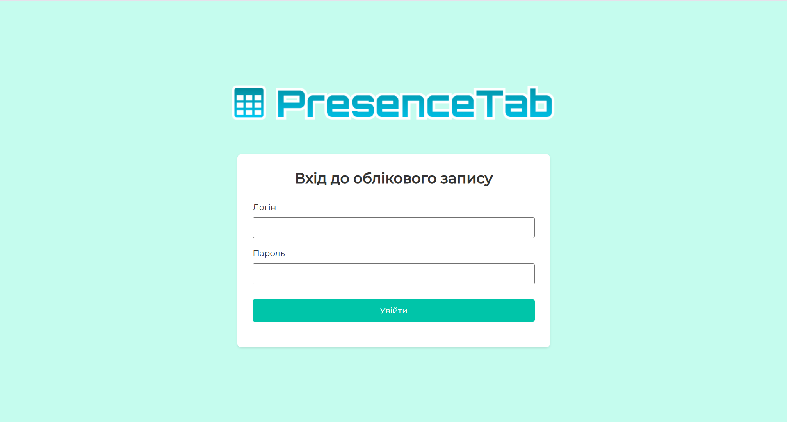
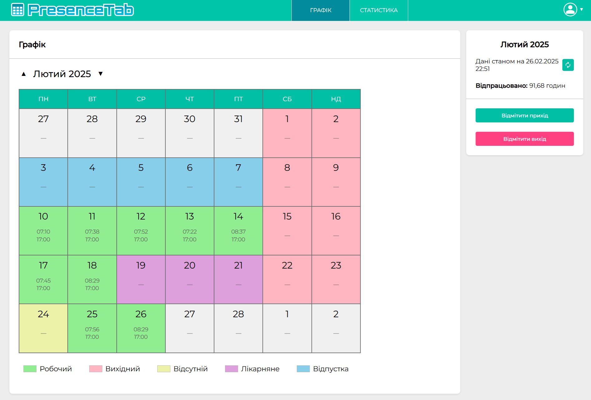
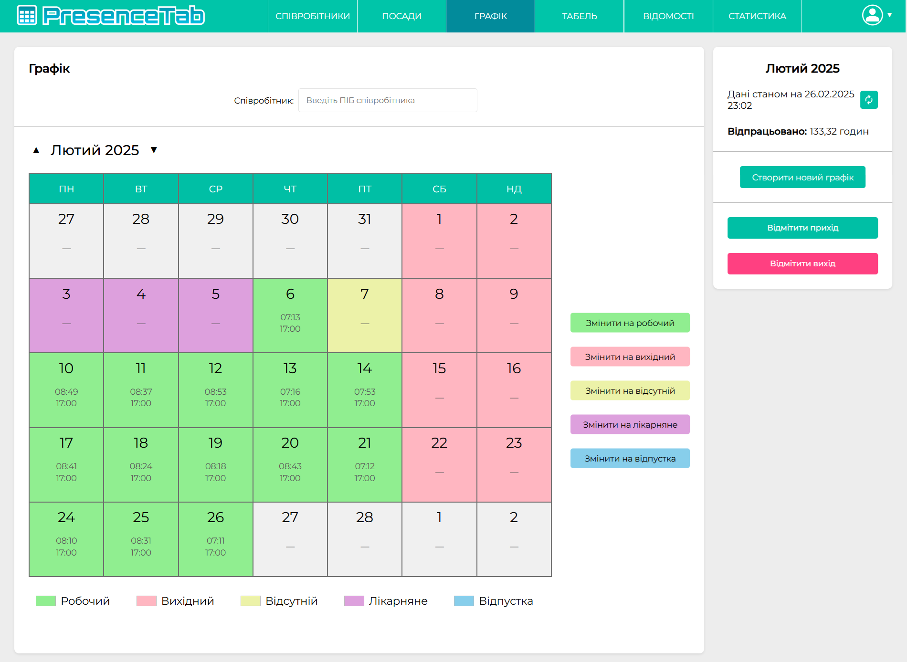
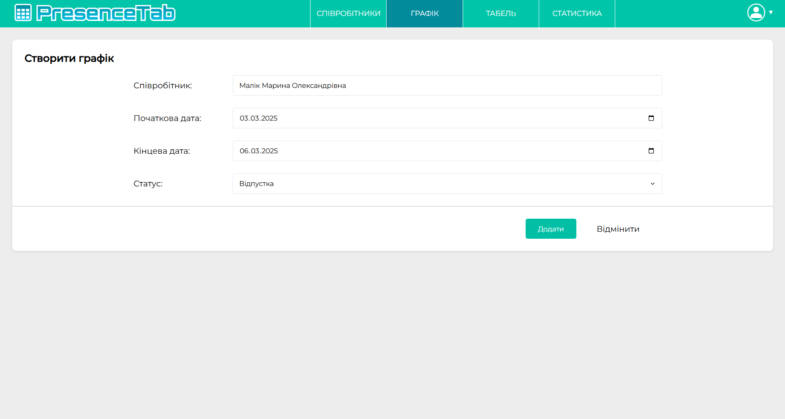
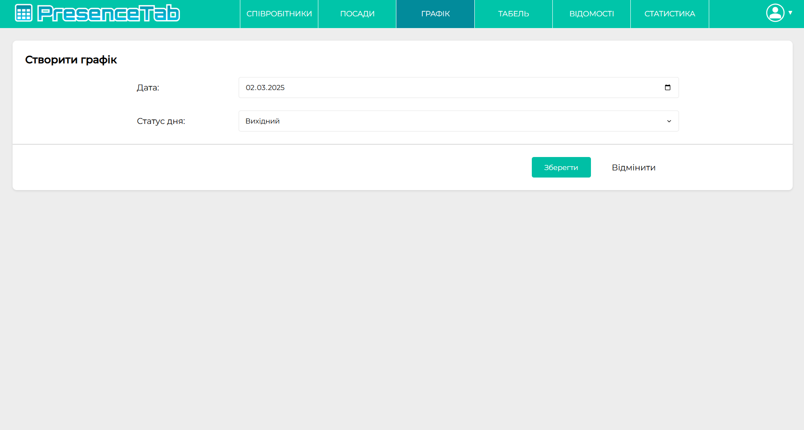
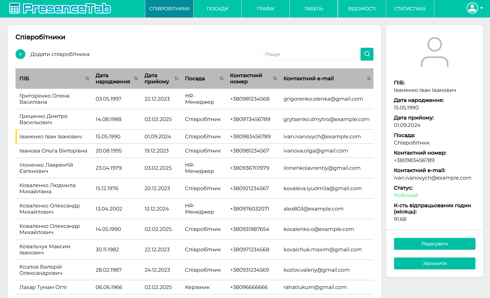
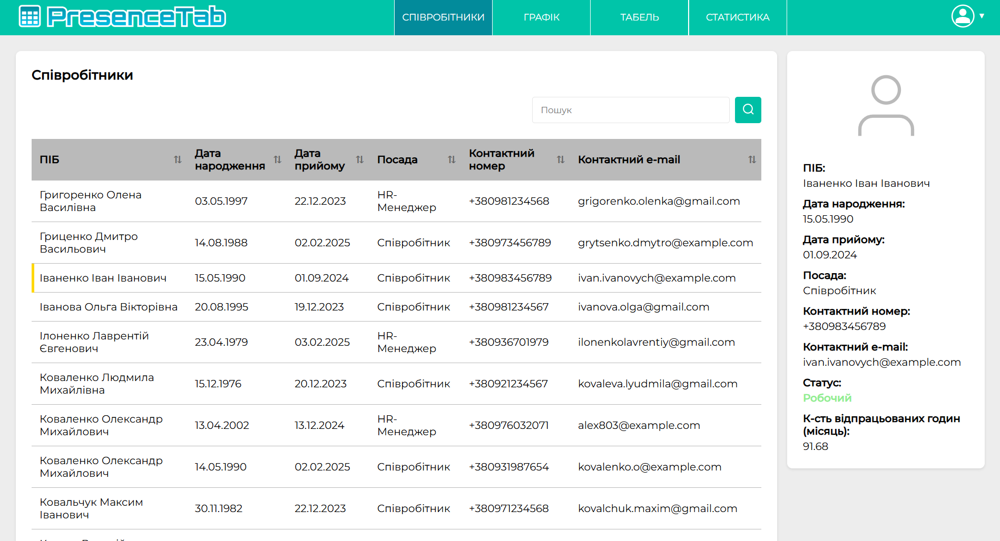
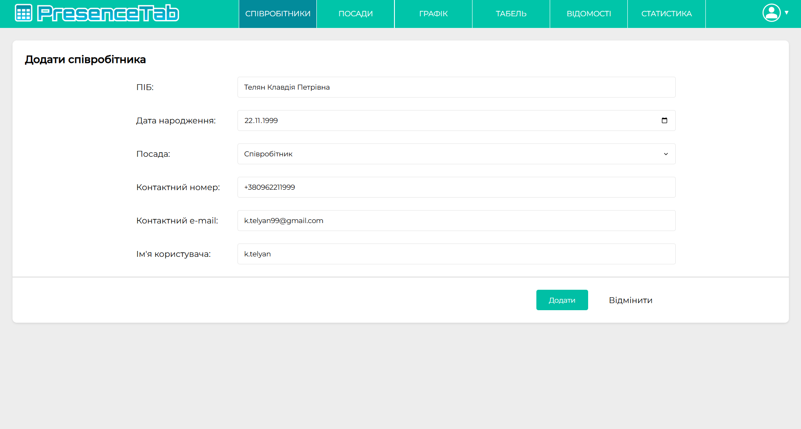
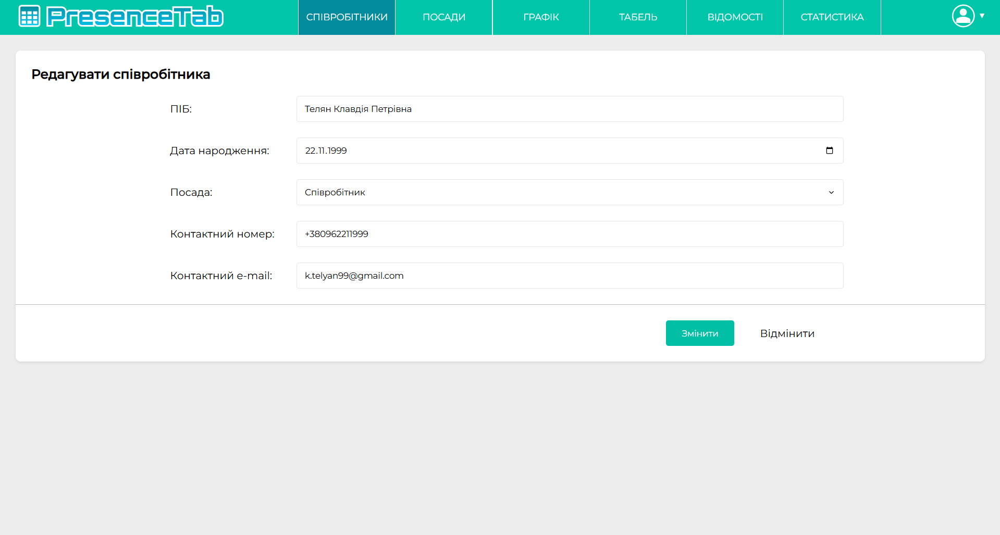

# Практика 2025. Розробка свого проекту

## Розробка інформаційної системи "PresenceTab" для табелювання співробітників і розрахунку заробітної плати

### Завдання

1. Розробка інформаційної системи для автоматизації процесу табелювання робочого часу співробітників
2. Створення модуля для розрахунку заробітної плати на основі табеля обліку робочого часу
3. Реалізація зручного інтерфейсу для HR-спеціалістів та бухгалтерів
4. Розробка бази даних для зберігання інформації про співробітників, їх робочий час та нарахування
5. Впровадження системи аутентифікації та авторизації з розмежуванням прав доступу

### Виконані завдання

Під час практики було виконано низку ключових задач, що дозволили створити функціональну інформаційну систему для табелювання співробітників і розрахунку заробітної плати:

### Структура системи PresenceTab

Система PresenceTab складається з кількох основних сторінок, кожна з яких відповідає за окремий аспект обліку робочого часу та розрахунку заробітної плати:

- **Сторінка "Співробітники"**: керування даними про персонал та структуру організації
- **Сторінка "Посади"**: управління списком посад та ставками оплати праці
- **Сторінка "Графік"**: календарний інтерфейс для обліку відвідування та типів робочих днів
- **Сторінка "Табель"**: формування табелів обліку робочого часу на основі даних з графіків
- **Сторінка "Відомості"**: робота з розрахунками заробітної плати
- **Сторінка "Статистика"**: аналітика та формування звітів для користувачів

Доступ до цих сторінок розмежовано відповідно до ролей користувачів, що забезпечує правильний розподіл відповідальності та захист даних.

**Архітектура системи**:
   - **Серверна частина**: ASP.NET, що забезпечує швидку обробку запитів та високу продуктивність
   - **Клієнтська частина**: HTML/CSS та JavaScript для створення інтуїтивно зрозумілого інтерфейсу
   - **База даних**: PostgreSQL для надійного зберігання даних з високим рівнем захисту
   - **Шаблон проєктування**: Model-View-Controller (MVC) для чіткого розділення бізнес-логіки, представлення та обробки запитів

#### Система авторизації та розмежування прав

Розроблена система включає надійний механізм аутентифікації та розмежування прав доступу для різних категорій користувачів:

**Ролі користувачів**:
   - **Співробітник**: базовий доступ лише до модулів "Графік" та "Статистика"
   - **Керівник**: розширений доступ до модулів "Співробітники", "Графік", "Табель" та "Статистика"
   - **HR-менеджер**: повний доступ до всіх модулів системи, включаючи "Співробітники", "Посади", "Графік", "Табель", "Відомості" та "Статистика"

#### Сторінка "Графік" 
Розроблена сторінка "Графік" є центральним компонентом системи, що забезпечує ефективний облік робочого часу співробітників з різними рівнями доступу:

**Інтерфейс для співробітника**:
   - Перегляд власного графіка роботи в календарному вигляді
   - Відмітка часу приходу та виходу
   - Відображення загальної кількості відпрацьованих годин
   - Візуальне розрізнення типів днів (робочий, вихідний, відпустка, лікарняний, відсутній)

**Розширений інтерфейс для керівника та HR-менеджера**:
   - Можливість перегляду та редагування графіків всіх співробітників
   - Створення нових графіків роботи
   - Функції для зміни статусу робочих днів (встановлення відпусток, лікарняних тощо)
   - Пошук співробітників для швидкого доступу до їх табелів

**Функціонал створення графіків**:
   - **Керівник**: може створювати індивідуальні графіки для конкретних співробітників, встановлювати періоди відпусток, лікарняних та інших типів відсутності

   - **HR-менеджер**: має можливість встановлювати загальні робочі та вихідні дні для всіх співробітників одночасно

#### Сторінка "Співробітники"

Сторінка "Співробітники" забезпечує повний облік даних про персонал організації з різними функціональними можливостями в залежності від ролі користувача:

**Функціонал для HR-менеджера**:
   - Повний перегляд даних про всіх співробітників
   - Додавання нових співробітників до системи
   - Редагування персональних даних
   - Можливість звільнення співробітників
   - Пошук по базі співробітників

**Функціонал для керівника**:
   - Перегляд даних про співробітників
   - Пошук співробітників за різними параметрами
   - Доступ до детальної інформації про кожного співробітника
   - Моніторинг статусу та відпрацьованих годин

**Управління даними співробітників**:
   - HR-менеджер має можливість додавати нових співробітників через форму з необхідними полями

   - Редагування існуючих даних співробітників (ПІБ, дата народження, посада, контактна інформація)

   - Можливість звільнення співробітників з автоматичним оновленням їх статусу в системі
   - Всі зміни одразу відображаються у загальному списку співробітників

#### Сторінка "Посади" 

Сторінка "Посади" доступна тільки для HR-менеджера і забезпечує керування списком посад та відповідними ставками оплати:

**Функціональні можливості**:
   - Перегляд списку всіх посад в організації
   - Встановлення почасової ставки для кожної посади
   - Відстеження дати затвердження ставок
   - Пошук по базі посад

#### Сторінка "Табель" 

Сторінка "Табель" є ключовим інструментом для точного обліку фактично відпрацьованого співробітниками часу і доступна як для керівника, так і для HR-менеджера:

**Функціональні можливості**:
   - Відображення даних про час приходу та виходу співробітників
   - Фільтрація даних за датою
   - Пошук співробітників за ПІБ
   - Автоматичне оновлення інформації в режимі реального часу

#### Сторінка "Відомості" 

Сторінка "Відомості", доступна тільки для HR-менеджера, є завершальним етапом процесу табелювання та розрахунку заробітної плати:

**Функціональні можливості**:
   - Формування відомостей нарахування заробітної плати за вибраний період
   - Можливість створення відомостей як для окремих співробітників, так і для всіх працівників
   - Фільтрація за посадами для гнучкого формування звітів
   - Автоматичний розрахунок заробітної плати на основі даних про відпрацьовані години та ставки
   - Експорт відомостей у формат PDF для подальшого використання

**Процес формування відомості**:
   - Вибір періоду (місяць, за який формується відомість)
   - Вибір співробітника (або всіх співробітників)
   - Вибір посади (або всіх посад)
   - Автоматичне формування відомості з розрахунком заробітної плати
   - Попередній перегляд сформованої відомості
   - Завантаження відомості у форматі PDF

#### Сторінка "Статистика"

Сторінка "Статистика" доступна для всіх користувачів системи, але з різним рівнем деталізації відповідно до ролі:

**Функціональні можливості**:
   - Візуалізація даних про присутність співробітників (кругова діаграма)
   - Аналіз розподілу робочих днів, відпусток, лікарняних та відсутностей
   - Графік нарахованої заробітної плати за обраний період
   - Фільтрація статистики за часовим проміжком
   - Для керівників та HR-менеджерів - можливість перегляду статистики по окремих співробітниках

**Особливості для різних ролей**:
   - **Співробітник**: доступ тільки до власної статистики
   - **Керівник** та **HR-менеджер**: можливість перегляду статистики по окремих співробітниках

### Висновок

За результатами практики було успішно розроблено інформаційну систему PresenceTab для табелювання співробітників і розрахунку заробітної плати. Система відповідає всім поставленим вимогам та забезпечує автоматизацію ключових процесів обліку робочого часу та нарахування заробітної плати.

Розроблена повноцінна система з інтуїтивно зрозумілим інтерфейсом, яка автоматизує процеси табелювання та розрахунку заробітної плати. Реалізовано гнучке розмежування прав доступу для різних категорій користувачів (співробітник, керівник, HR-менеджер), що забезпечує зручність використання та захист даних.

Впроваджено ключові сторінки системи: облік співробітників та управління персональними даними, керування посадами та ставками оплати, створення та редагування графіків роботи, табель обліку робочого часу з фіксацією часу приходу та виходу, автоматичний розрахунок заробітної плати та генерація відомостей, а також аналітична сторінка для відображення статистики.

Забезпечено високий рівень безпеки завдяки сучасним методам захисту даних, аутентифікації та авторизації користувачів. Окрему увагу приділено оптимізації продуктивності системи для забезпечення швидкої обробки запитів навіть при великій кількості користувачів.

Практичне значення розробленої системи полягає у підвищенні ефективності роботи HR-відділу та бухгалтерії, зменшенні кількості помилок при розрахунках та забезпеченні прозорості процесу нарахування заробітної плати. Система PresenceTab може бути легко адаптована до потреб різних організацій та інтегрована з іншими корпоративними системами.
